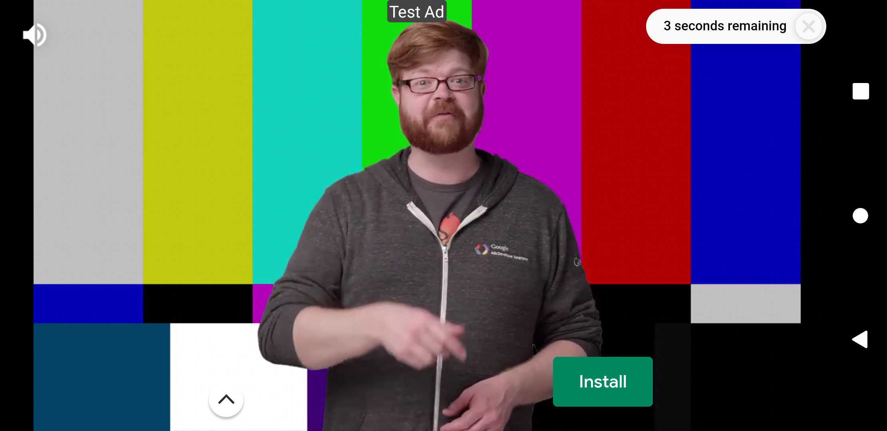

# history_gamproject

<p>




 </p>
 
## 개요

```
박정희 전 대통령의 암살 시기의 일어난 일들을 각색하여 시뮬레이션게임 형태로 만든 어플리케이션 입니다.   
처음에는 안드로이드 개발로 의뢰를 받았었는데 해당 어플리케이션이 일반적인 형태가 아니라 progress에 따라
화면이 이동하고 자막이 자동으로 표시되는등 구현하기 까다로운 부분이 있을것같아flutter로 개발하였습니다.    
상태관리 라이브러리는 GetX를 사용, googleAdmob 등이 사용되었으며, 
자막의 자동 재생, 빠르게 하는 등의 기능이 있는 widget은 외부 라이브러리를 사용하지않고 직접 개발하여 사용하였습니다.
```
 
## 개발 기간
 - `11.1 ~ 12.1`
 - `작업자 : 임세준`   
 - `연락처 : 010-2357-7966`   
 - `이메일 : qpfjf56@gmail.com`

## 개발 환경
 - `Framework : Flutter 2.5.3 stable`

## 타겟
 - `android, iOS, iPadOS`


## Apk 다운로드
https://drive.google.com/file/d/1oQpT4OWSv6usIdquM1vje4cs1w2qTxy7/view?usp=sharing
